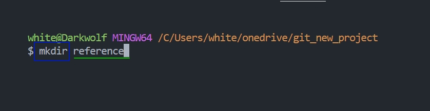

---
#Основные команды в терминале для начала работы: >_________
---
1. *_Для перехода между разделами используется команда:_*  `cd и к ней дописывается путь куда нужно перейти`
>например:  
        
---
2. *_Для создание директории через терминал используется команда_* - `mkdir к ней дописывается название которое мы хотим придать директории`
>например: 
      
---
3.  *_Для создание файла через терминал используется команда_* - `touch рядом с ней прописывается название, которое хотим придать файлу`
> Например: 

---
4. *_Для переименования файла или директории используется команда_* - `mv рядом прописывается старое название и следом новое название, обязательно нужно учесть, что между словами не должно быть пробелов в названии для этого можно использовать нижнее подчёркивание (_) или тире (-)`
> Например: 

---
5. *_Для того чтобы скопировать файл или директорию используется команда_* - `cp рядом прописывается название файла или директории, которые нужно скопировать и рядом  дописываем уже название длля копии`
>Например: 
   
---
6. *_Чтобы в файл внести какую-нибудь запись используется команда_* - `echo "тут текст который нужно внести" > тут название файла куда нужно внести текст` 
> Например: 
       
---
7. *_Для того чтобы просмотреть файл используется команда_* - `cat и рядом пишем название файла`
> Например: 
            
 ---
8. *_Для того, чтобы удалить файл или директорию используется команда_* - `rm или чтобы на верняка удалилось rm -R и рядом пишем название файла которое хотим удалить`
> Например: 
 
---

---
#Команды Git 
##>__________
---
Setup
----
---
>***__При первой работе с Git нужно выполнить следующие команды:__***
----
a. `git config --global user.name “[firstname lastname]` _тут вводим своё имя или ник_ 

----
b. `git config --global user.email “[valid-email]”` - _тут вводим свой адрес эл. почты_

---
`git config --global color.ui auto` - _эта строка кода добавляет подстветку текста в терминале, что очень удобно._

---
STAGE & SNAPSHOT
---
---

* **_Для того чтобы, начать работать с Git нужно установить его в репозиторий, для этого используется команда_** - `git init`
> Например: 
 
    
---
*  *_Чтобы выгрузить репозиторий к примеру с того же Github нужно выполнить следующую команду_* `git clone [url]`
>Например:  
          
---
* *_Для того чтобы узнать об изменениях в файлах репозитория используется команда_* - `git status`
> Например:  
   
   
   ---
   * *_Для того чтобы добавить файл или файлы к коммиту нужно сначала сохранить текущее состояние файла нажав сочетание клавиш_* `ctrl+s`   *_а после выполнить команду_* `git add с названием файла`
   > Например: 
   
   ---
   * *_Для того чтобы сделать сброс в файла в репозитории нужно выполнить следующую команду_* `git reset [file]`
   > Например: 

   ---
   * *_Для того чтобы увидеть разницу между текущим и закомиченным файлом используется команда_* - `git diff` 
   > Например: 
   ---
   **_Также можно воспользоваться ещё одной командой принцип работы у нее такой же только она показывает разницу с тем что ещё добавилось в файл, текущие изменения, которые еще не внесены_* `git diff --staged` 
> Например: 
   ---
   * *_Для того чтобы добавить коммит, нужно воспользоваться следующей командой_* - `git commit -m также можно комитить и таким способом git commit тогда откроется терминал и в нем нужно нажать i и ввести коментарий а после нажать esc wq и нажать enter`
   > Например: 
   
   ---
BRANCH & MERGE
   ---
----
* *Для того чтобы вывести список веток нужно воспользоваться командой_* - `git branch`
*_она покажет какие ветки у нас есть, и покажет на какой ветке мы сейчас находимся_*.
> Например: 
---
*_Для создания новой ветки нужно воспользоваться командой_* `git branch [branch-name]`
> Например: 
 
 ---
* *_Для перехода между ветками используется команда_* - `git checkout и рядом пишется название той ветки куда нужно перейти`
> Например:  

---
* *_Для того чтобы провести слияние веток нужно воспользоваться командой `merge рядом пишется название той ветки которую нужно объеденить` 
*_Важно!_ 
Если нам нужно произвести слияние с основной веткой `master` , то сперва нам нужно на неё перейти воспользовавшись командой `git checkout master`  и после уже выполнять команду `merge`
>Например: 

---

* *_для проверки всех изменений в текущей ветке используется команда_* - `git log `
>Например: 

---
INSPECT & COMPARE

---

* *_Для того чтобы, посмотреть историю изменений на текущей ветке, следует воспользоваться командой_* `get log`
> Например: 

---
* *_Для того чтобы посмотреть историю файла, даже если он был переименован, можно воспользоваться следующей командой: `git log --follow [file]` 
>Например:  
=======
тут  будет конфликт!
тут будет конфликт при слиянии!
конфлике решен!
* *_Для того чтобы посмотреть историю файла, даже если он был переименован, можно воспользоваться следующей командой: `git log --follow [file]` 
>Например:  
>>>>>>> conflict
